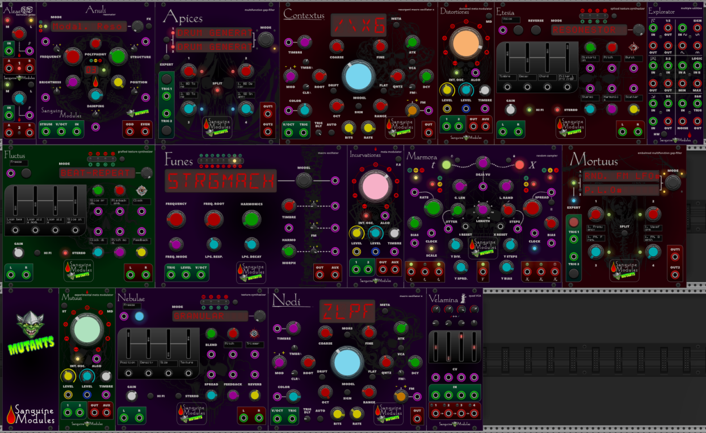

# Sanguine Modules Mutants

## Modules

## Funes

Based on Mutable Instruments Plaits and Audible Instruments Macro Oscillator 2. It exposes every control and can access the 1.2 firmware modes.

An editor for some of the new firmware modes modes is available in this repository! You need to download it and run it locally in your browser.

## Mutants Blank

Put a goblin and the Mutants logo on your rack!