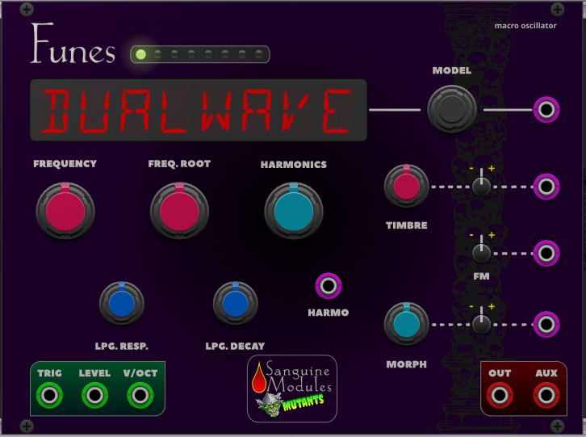

# Sanguine Modules Mutants

## Modules

## Funes

Based on Mutable Instruments Plaits and Audible Instruments Macro Oscillator 2. It exposes every control and can access the 1.2 firmware modes.

An editor for some of the new firmware modes modes is available in this repository! You need to download it and run it locally in your browser.

Thanks to jpnielsen for the table below that details the voltage values to modulate the model.

| #  | Display  | Description                    | Model CV (V) |
|----|----------|--------------------------------|--------------|
| 1  | FLTRWAVE | Classic waveshapes with filter | 0.00         |
| 2  | PHASDIST | Phase distortion               | 0.22         |
| 3  | 6 OP.FM1 | 6-operator FM 1                | 0.43         |
| 4  | 6 OP.FM2 | 6-operator FM 2                | 0.65         |
| 5  | 6 OP.FM3 | 6-operator FM 3                | 0.87         |
| 6  | WAVETRRN | Wave terrain synthesis         | 1.09         |
| 7  | STRGMACH | String machine                 | 1.30         |
| 8  | CHIPTUNE | Chiptune                       | 1.52         |
| 9  | DUALWAVE | Pair of classic waveforms      | 1.74         |
| 10 | WAVESHAP | Waveshaping oscillator         | 1.96         |
| 11 | 2 OP.FM  | Two operator FM                | 2.17         |
| 12 | GRANFORM | Granular formant oscillator    | 2.39         |
| 13 | HARMONIC | Harmonic oscillator            | 2.61         |
| 14 | WAVETABL | Wavetable oscillator           | 2.83         |
| 15 | CHORDS   | Chords                         | 3.04         |
| 16 | VOWLSPCH | Vowel and speech synthesis     | 3.26         |
| 17 | GR.CLOUD | Granular cloud                 | 3.48         |
| 18 | FLT.NOIS | Filtered noise                 | 3.70         |
| 19 | PRT.NOIS | Particle noise                 | 3.91         |
| 20 | STG.MODL | Inharmonic string modeling     | 4.13         |
| 21 | MODALRES | Modal resonator                | 4.35         |
| 22 | BASSDRUM | Analog bass drum               | 4.57         |
| 23 | SNARDRUM | Analog snare drum              | 4.78         |
| 24 | HI-HAT   | Analog hi-hat                  | 5.00         |